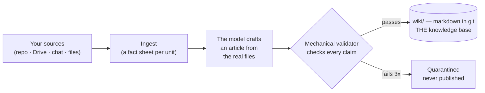
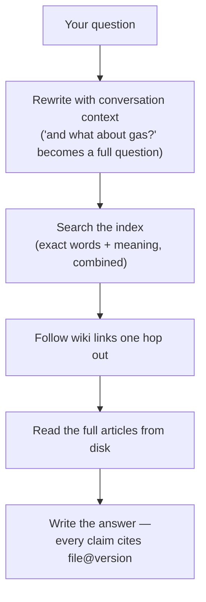

# Cairn

**Turn everything your team already knows into a wiki that cites its sources —
and then ask it questions.**

Cairn connects to the places knowledge actually lives (a Git repo, Google Drive,
chat history, a pile of files), writes wiki articles about what it finds, and
answers questions from those articles. Every factual sentence in an answer
carries a citation you can click through to the exact file at the exact version
it came from. When the wiki does not cover your question, Cairn says so instead
of guessing.

It runs entirely on your machine. With [Ollama](https://ollama.com) installed
and no API key anywhere, it works and costs nothing.

```bash
git clone https://github.com/adityadubey1996/Cairn.git && cd Cairn
docker compose up -d --build     # http://localhost:8300
```

---

## The one idea everything else follows

> **Git is the only place knowledge lives. Everything else is a disposable copy.**

The knowledge base is a folder of ordinary markdown files, committed to a repo.
Cairn's index, its database and its clones are all caches — delete them and
they rebuild. Nothing of value lives only inside Cairn, which is what makes it
safe to throw away, and what stops it becoming another silo.

An article is written *about* something: what a module does, why it is built
that way, what is known, what is disputed, what nobody knows yet.

---

## Bring your own model

Cairn has no API key of its own and never will. Whatever you point it at pays
for the answers, and the resolution order is designed so the common cases need
no configuration at all:

1. Whatever you chose on the **Settings** screen
2. `LLM_PROVIDER` in `.env`
3. **Any provider key present in `.env`** — drop one in and it is picked up
4. **Ollama**, if it answers on this machine

So all three of these are valid, complete setups:

```bash
# Free and local. Nothing in .env at all.
ollama pull llama3.1:8b
ollama pull nomic-embed-text     # embeddings — always local, never a key

# Or paste one key into .env and restart. Nothing else to configure.
ANTHROPIC_API_KEY=sk-ant-...

# Or point it at anything OpenAI-compatible — vLLM, LM Studio, a gateway.
LLM_PROVIDER=custom
LLM_BASE=http://localhost:8000/v1
LLM_MODEL=my-model
```

Built-in presets: **Claude**, **Ollama**, **Groq**, **DeepSeek**,
**OpenRouter**, **Gemini**, and **Custom** for any OpenAI-compatible endpoint.
The Settings screen lists the local models you have actually pulled, suggests
the best one, and prints the exact `ollama pull` command when you have none.

Two request shapes cover all of it — OpenAI-compatible `/chat/completions` and
Anthropic's `/v1/messages` — so there is no SDK to install for a provider you
do not use. It is all in [server/llm.py](server/llm.py).

*Known limit:* article **generation** speaks the OpenAI shape only. With a
Claude-only setup, chat works but that step asks you for an OpenAI-compatible
key (or uses Ollama, free). It tells you this plainly rather than failing oddly.

---

## Connectors

Every connector runs locally against **your** account, with your own OAuth
client or token. Nothing is proxied through a service.

| Works today | Needs |
|---|---|
| Upload (files & folders) | nothing |
| Links | nothing |
| GitHub repos | nothing public · a read-only PAT for private |
| Google Drive | your own Google OAuth client |
| Google Chat | the same Google OAuth client |
| WhatsApp · LinkedIn | Steel browser + which chats to read |

Gmail, Outlook, OneDrive, Teams and Jira appear in the Connect screen **greyed
out**: they are on the roadmap but have no feeder behind them yet, so they are
shown as not built rather than offered and then failing.

Ask the running server what is still missing, instead of guessing:

```bash
curl -s localhost:8300/api/connectors/preflight | python3 -m json.tool
```

It names the exact unset variable per connector. **[CONNECTORS.md](CONNECTORS.md)**
has the click-by-click setup, including the Google Cloud steps.

---

## How knowledge gets made



1. **Ingest** produces one *fact sheet* per unit — which files it contains, what
   calls into it, what it depends on. Free, deterministic, no model involved.
2. **The model drafts** an article from the actual files on that sheet. Every
   claim must carry a grade and a citation to a real file at a real version. It
   cannot cite a file it was not shown.
3. **The validator checks it mechanically** — no model judgement. Do the cited
   files exist? Are the versions current? Does every graded claim have a
   citation? Do the named functions actually appear in the cited files? Drafts
   failing three attempts are quarantined, never published: a confidently wrong
   article is worse than a missing one.
4. **A human merges.** Nothing enters the knowledge base without that.

## How a question gets answered



Two details are what make the answers good:

- **Search alone is not enough.** The article that completes an answer is often
  not *similar* to your question — it is *linked* from the one that is. So
  Cairn expands one hop along wiki links before reading.
- **It reads whole articles from disk**, never snippets from its own index. The
  index only decides *what* to read.

While this happens you watch it happen: a live activity card shows searching →
index hits → which articles are being read → generating, then collapses into a
line you can expand later. That record is saved with the answer, so you can
always see what it read before it replied.

---

## Reading an answer

**Citations.** Chips like `service.py@79ca6d9` link to the exact file and
version. A sentence with no citation is filler, not fact.

**The trust line**, e.g. `context: 12 articles · verified 14 · code 24 · doc 82
· conflict 3 · gap 12`, is the honesty summary of what was read:

| Grade | What it means |
|---|---|
| **verified** | In a document *and* confirmed against the code. Strongest. |
| **code** | Read directly from source. Strong. |
| **doc** | Claimed in a document, never checked against code. Could be stale. |
| **conflict** | Docs and code *disagree*. Both sides are kept; Cairn never silently picks a winner. |
| **gap** | A known unknown, recorded honestly. |

**Badges.** `no wiki coverage — uncited answer` means the knowledge base does
not cover your question and Cairn is telling you rather than guessing.
`stale — pending re-verification` means cited versions have moved since.

## What Cairn deliberately does not do

- It does **not** answer from the model's general knowledge. No coverage means
  it names the nearest articles it found and stops.
- It does **not** let unreviewed generated text into the knowledge base.
- It does **not** require anyone reading it to have repo access.
- It does **not** phone home. No telemetry, no accounts, no vendor key.

---

## Running it

### Docker (everything)

```bash
docker compose up -d --build     # brain :8300, Postgres, S3 emulation
docker compose logs -f brain
```

### From source

```bash
cp .env.example .env             # optional — every value has a default
docker compose up -d db          # just Postgres (host port 5434)

uv venv --python 3.11 && uv pip install -r requirements.txt
.venv/bin/uvicorn server.app:app --port 8300

cd web2 && npm install && npm run build   # or `npm run dev` for hot reload
```

Requires Python 3.11+, Postgres, and either Ollama or one provider key.
Embeddings always run locally through Ollama (`nomic-embed-text`); without it
retrieval degrades to keyword search rather than breaking.

### Tests

```bash
.venv/bin/python -m pytest server pipeline -q     # 220 tests, no DB needed
```

The suite is green with no database and no network. Tests that need Postgres
skip themselves when it is unreachable.

---

## Layout

| Path | What |
|---|---|
| `server/` | FastAPI on :8300 — auth, sync, index, retrieval, chat SSE, wiki API |
| `server/llm.py` | the BYOK provider layer — every model call goes through here |
| `server/application/` | the answer pipeline: condense → recall → assemble → framing → synthesize |
| `server/connectors.py` | the connector registry; `REGISTRY` is the source of truth |
| `feeders/` | one folder per connector, each exposing `run()` |
| `pipeline/` | ingest → absorb → validate: how articles get written and checked |
| `web2/` | the React UI (Vite + Tailwind) |
| `var/` | indexes and sync state — disposable caches, gitignored |

**Retrieval:** hybrid search — SQLite FTS5 (BM25) plus one vector per article,
fused by reciprocal rank — then one-hop wikilink expansion in both directions,
then full articles loaded from disk into a ~10k-token budget.

**Auth:** `AUTH_MODE=dev` bypasses everything (localhost only).
`AUTH_MODE=google` verifies Google ID tokens server-side — JWKS signature,
`aud`, optional `hd` domain, `email_verified` — and mints a short-lived session
JWT.

---

## Contributing

Adding a connector is a `run()` in `feeders/<name>/sync.py` plus one `REGISTRY`
entry — the health screen, run history, status and preflight are all generic.
See [CONNECTORS.md](CONNECTORS.md#adding-a-connector).

Two house rules worth knowing before you send a patch: **a name is its
documentation** (if a comment explains *what* code does, the name is wrong —
comments are for non-obvious *why*), and **no unbounded growth** (any
collection that grows needs an eviction rule).

## License

MIT — see [LICENSE](LICENSE).
